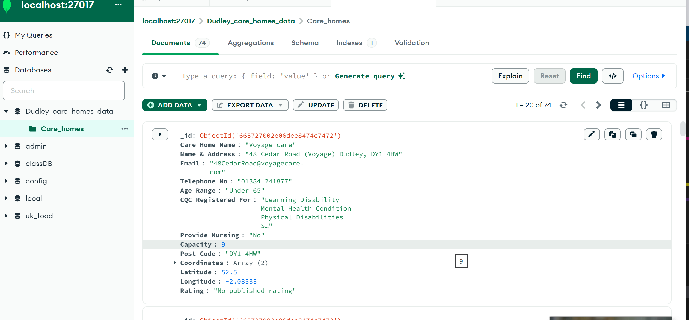
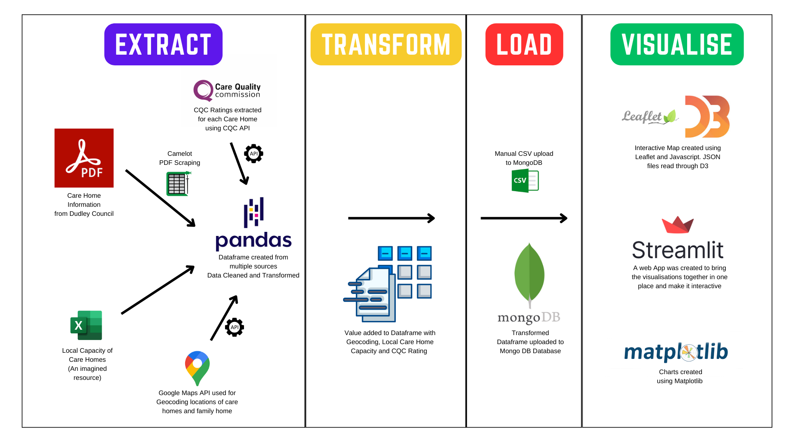

## Date : 3rd June 2024

# Project-3-Care-Home-Team-5

# Overview

We proposed to create a free, open-source tool which can assist families in choosing a care home for their loved ones. There are commercially listed websites which can help in this process, but there can be bias in the information. Some care homes may be promoted on the search through paid advertising, and websites could omit care homes that are not willing to pay for advertising subscriptions. We have chosen the Dudley borough in the West Midlands as a test bed for our project. The Dudley Council has its own [website](https://adultsocialcaremarketplace.dudley.gov.uk/) hosting the search for local care homes in the area; however, this produces a simple list of care homes without visualisation of the care homes on a map.
 
We aimed to create an unbiased search tool for hospitals and families looking for care homes funded by the Dudley Borough Council. As we have taken the visualisation track for this project, we display all the care homes on an interactive map close to the family home, which can better inform potential visitors about travel. We were also able to layer other features the care homes provide using other specialist services. We also provide a tabular visualisation of the types of care homes, beds, and services the council has access to help future commissioning on the population's needs.      
     

## Team Members

- Najma Ali
- Abdifatah Daoud
- Eleanor Duplock
- Mohammad Liaqat
- Murali Veerabahu
  
# Data
 
We used two main sources for the data for our project:
 
**Dudley Borough Council Website -**
On the Dudley council website, we found an existing pdf file which listed the council funded care homes, basic contact information and a few further details.
 
**Care Quality Commission (CQC) API -**
We then gathered extra data from the CQC API, using this we gathered information about the most recent CQC rating.
 
These sets of data were combined and cleaned. Age ranges were changed to minimum and maximum age categories, and postcodes were used to calculate latitude and longitude coordinates for plotting on the maps.

We loaded this combined and cleaned data into a new MongoDB database.



# ETL process



This ETL process ensures the effective extraction, transformation, and loading of data from diverse sources. The subsequent visualizations make the data accessible and interactive, thereby assisting families and caregivers in making well-informed decisions regarding care homes.

### Extraction Phase:

**PDF Extraction:** Utilizing Camelot to scrape data from Dudley Council PDFs. **API Integration:** Fetching up-to-date care home ratings via the Care Quality Commission (CQC) API. **Excel Data Import:** Aggregating local capacity data from Excel files.
**Geocoding:** Using Google Maps API to obtain geographic coordinates for care home locations.

### Transformation Phase:

**Data Integration:** Merging data from all sources into a unified DataFrame using Pandas. **Data Cleaning and Enrichment:** Ensuring data consistency and enriching it with geocoding information, local capacity details, and CQC ratings.

### Load Phase:

**Database Storage:** Uploading the cleaned and transformed data as a CSV file to MongoDB for efficient handling of both structured and unstructured data, enabling easy querying and retrieval.

### Visualization Phase:

**Interactive Mapping:** Creating an interactive map with Leaflet and D3.js to visualize the geographic distribution of care homes. **Web Application:** Developing an interactive web app with Streamlit to facilitate data exploration. **Analytical Charts:** Utilizing Matplotlib to generate various charts and graphs, highlighting trends in care home ratings and capacity.

# Instructions on how to use and interact with the project

### API Keys
For security the API keys used to geocode and access CQC ratings have been hidden in seperate files. The Google API was used for geocoding. For the google API a google_key needs to be created and saved in the [code](code) directory.
```python
    google_key = "Insert your Google API Key"
```
For the interactive maps using Javascript again a google API key is necessay. Please create a config.js file in the [imap](code/imap) folder with the following code.
```javascript
    const config = {
        google_key : "Insert your Google API Key"
    };
```
For the CQC API an api_key.py file needs to be created in the [code](code) folder
```python
   subscription_key = "Insert your CQC API Key"
```


### Interactive map of Dudley Council Funded Care Homes
We have created an interactive map which shows the Dudley area. It has markers for all the council funded care homes. This is then filterable based on care needs, such as dementia, physical disability, mental health and more. Additionally, the user can add a marker of a home address to see which care homes are best located. Clicking on a marker then shows additional information; contact details, a latest CQC rating and the care needs the care home can support. 
 

To see this visualisation please run the [index.html](code/imap/index.html) in the [imap](code/imap) folder. The file will need to be run using a Python server as the JSON file is saved locally in the data folder.

### Streamlit App
The streamlit app opens to a page asking the user to enter a home address and age of the patient. Using the Google API it then returns a sorted dataframe of care homes, sorted by driving distance, with information such as the address, a colour coded CQC rating, and capacity. This dataframe has the ability to update according to live data, the listed capacity is the number of available beds, these are stored in a separate file (which could be regularly updated) and so lets users know a current available capacity.

 
To visualise the streamliy app, please run the following command in the terminal\git bash and it will open the app in your web browser:
```cmd
    streamlit run Find_Care_Home_App.py
```


### Matplotlib Visualisations
We also created a series of visualisations using matplotlib which show a variety of care home statistics. These can be used for general information or for commissioning purposes - to see how well the current care homes cover needs. There are graphs which show care home age-range distributions, capacity distribution, the provision of nursing care, and CQC rating. These graphs can be found in the [output folder](output).


# Ethical Considerations

All our data comes from publicly accessible sources, and contains no personal information, meaning there are few ethical concerns.
The Dudley council website and the CQC API states that all information is covered by the Open Government License which allows anyone to use and adapt information as long as the data is the latest version, and the sources are referenced as we do below.

The user is asked to input some personal data (e.g. an address) into the application, but this is not connected with any other personal information, and we do not collect or store this information in anyway.


# References

1. Dudley Borough Council website and PDF- https://www.dudley.gov.uk/residents/care-and-health/adult-health-social-care/housing-with-care-and-support/care-homes-residential-and-nursing/

2. Dudley List of Contracted Care Home Providers - https://www.dudley.gov.uk/media/ktclgusy/2023-24_approved_care_home_providers_within_the_dudley_borough_available_to_the_public.pdf

3. Care Quality Commission API - https://api-portal.service.cqc.org.uk/api-details#api=syndication&operation=get-changes-within-timeframe

4. Camelot (pdf) scraping tool - https://camelot-py.readthedocs.io/en/master/

5. matplotlib - https://matplotlib.org

6. streamlit - https://streamlit.io

7. google maps api - https://developers.google.com/maps

8. geojson code - https://gist.github.com/Spaxe/94e130c73a1b835d3c30ea672ec7e5fe - *Code from this source was used to convert CSV data to a JSON file*


